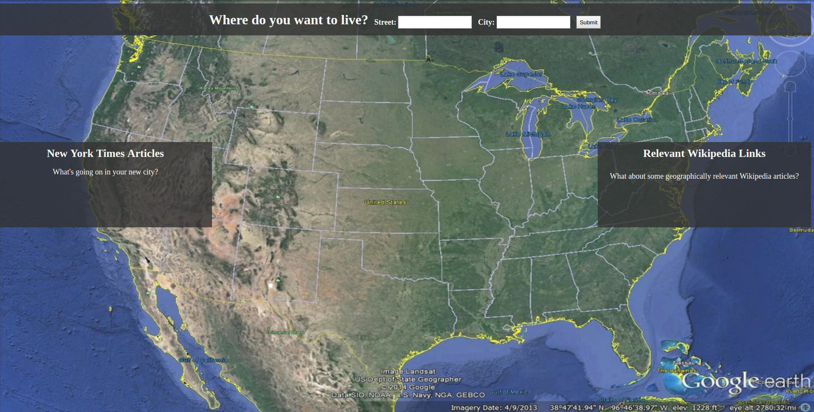
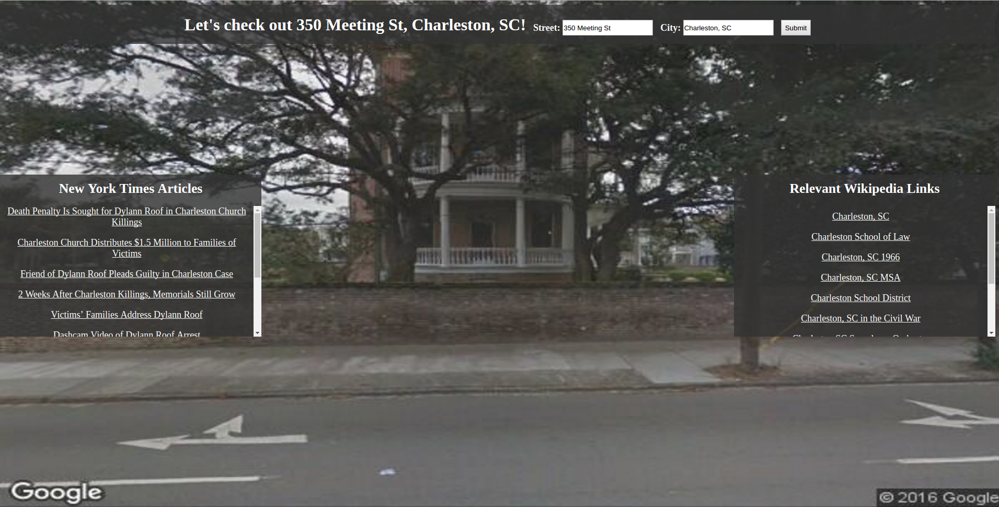

## MovingApp

Based on Udacity Front-end Web Developer Nanodegree.
Small project building a web application focusing on HTML, CSS, JS and working with various API endpoints such as the New York Times Article Search API, Wikipedia pages API and Google Street View API. The user can enter an address, see an image of the street view as the webpage background, and get relevant NY Times articles and Wikipedia pages.

#### Running MovingApp

An easy way to deploy apps is by using the [npm http-server](https://www.npmjs.com/package/http-server), which runs a no-configuration command-line http server. If you choose this option, make sure you have [npm](https://docs.npmjs.com/getting-started/installing-node) installed before running the below commands.

First, install http-server globally:

	npm install http-server -g

Then clone the MovingApp repository into empty directory:

	git clone https://github.com/bmb0205/MovingApp.git TargetDirectory/

cd into TargetDirectory/, then run:

    http-server -o

MovingApp should automatically deploy in your browser.

**MovingApp**

	|--css/
	|	|
	|	|--style.css
	|
	|--js/
	|	|
	|	|--libs/
	|	|	|--jquery.min.js
	|	|
	|	|--script.js
	|	|
	|-images/
	|	|
	|	|--earthUS.jpg
	|	|--home.png
	|	|--address.png
	|
	|--index.html
	|--README.md

